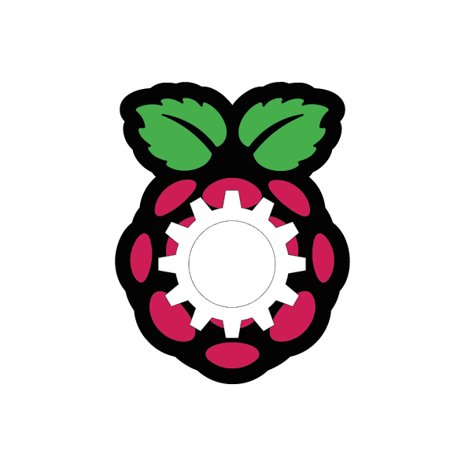

<p align="center">
  
</p>

# Raspberry PI setup with Ansible

Setup your RPI from scratch with only one command!

## Description

This repository contains Ansible tasks needed to setup the following modules on RPI:

* periodical autoupgrade
* bigger SWAP
* GIT config
* secure SSH and generate key
* ZeroTier
* pyenv
* cups and airsane for printers
* docker (also moves docker files to a USB to save storage on the internal SD card)
* personal projects

## Getting Started

### Dependencies

* Python (tested on 3.11.6 and Linux) on the host
* Raspberry Pi with a debian-based OS (tested on Raspberry Pi OS 64-bit bookworm and RPI 3B+). See [Raspberry Pi OS Imager](https://www.raspberrypi.com/software/) if you didn't install it yet.

### Installing

You need to install Ansible. For that use:

```sh
pip install -r requirements.txt
```

Copy and fill out the following files:

1. `inventory.yml.example` as `inventory.yml` - change user and host
2. `main.yml.example` as `main.yml` - supply missing vars, optionally comment out or edit the tasks

### Executing

First debug the connection:

```sh
ansible-playbook -i inventory.yml debug.yml
```

If everything works, run the full suite:

```sh
ansible-playbook -i inventory.yml main.yml -vv
```

## Authors

* Kacper Leśniara ([kacper.lesniara@gmail.com](mailto:kacper.lesniara@gmail.com))

## License

This project is licensed under the MIT License - see the [LICENSE.md](./LICENSE.md) file for details
